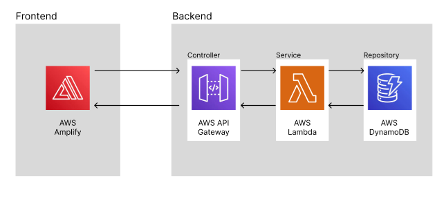
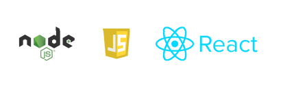

# Bank Code API

## Overview

This codebase is part of an AWS project designed to provide a lightweight set of APIs. It leverages AWS services such as API Gateway, Lambda, and DynamoDB to create a robust and scalable infrastructure.

## Main Components

The main entry point of the application is the `index.mjs` file, which contains the handler function for an AWS Lambda. This Lambda function is structured to use the Lambda Proxy integration with API Gateway. 

The decision to use Lambda Proxy integration was driven by its simplicity and cookie-cutter approach, which fits perfectly with the purpose of this Lambda function. Unlike the traditional Lambda integration, Lambda Proxy integration provides a streamlined setup where the entirety of a client's request is sent to the Lambda function, and the function's response is returned to the client.

## Advantages of Lambda Proxy Integration

Lambda Proxy integration offers several advantages:

- **Simplicity**: It simplifies the setup by removing the need for input and output mapping in API Gateway.
- **Efficiency**: It allows the Lambda function to have full control over the processing logic, making it more efficient for simple use cases.
- **Flexibility**: It provides the Lambda function with the entire request context, including path parameters, query string, headers, and the request body, offering more flexibility in handling requests.

## Motivation

The motivation behind this project was to create a cost-effective alternative to an existing API provider. The original provider's rates were considered high, which led to the decision to create a similar API that interacts with the same database but offers the service at a more affordable cost.

## Goal

By replicating the functionality of the original API and hosting it on AWS, this project aims to provide the same value to users while reducing their costs.

## AWS Infrastructure

[Link to Design](https://www.figma.com/file/6mJuiHg02PaUauugLAe5jo/Untitled?type=design&node-id=0%3A1&mode=dev&t=MMf4z1UdkeQighjr-1)

## Frameworks and Language

[Link to Design](https://www.figma.com/file/6mJuiHg02PaUauugLAe5jo/Untitled?type=design&node-id=0%3A1&mode=dev&t=MMf4z1UdkeQighjr-1)